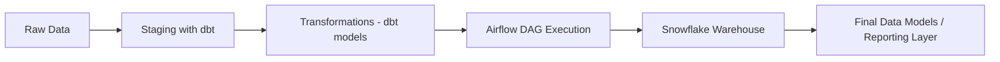

# 🛒 salespulse-pipeline

An end-to-end data pipeline for processing and analyzing customer, product, and order data using modern data engineering tools. This project simulates a real-world e-commerce analytics workflow from raw data ingestion to final data models and dashboards.

## 🚀 Tech Stack

- **dbt (Data Build Tool)** – For transforming raw data into clean, analytics-ready models.
- **Apache Airflow** – For orchestrating and scheduling the pipeline workflow.
- **Snowflake** – Cloud-based data warehouse used to store and query the data.
- **Docker** – To containerize the development environment and ensure consistency.

## 📊 Dataset Overview

The pipeline processes synthetic e-commerce data related to:

- Customers
- Products
- Orders
- Order Items (Parts requested)

## 🔁 Pipeline Flow


⚙️ Getting Started
Clone the repository:

```
git clone https://github.com/OmarAbdelaleem/salespulse-pipeline.git
cd salespulse-pipeline
```
Start Docker containers:

```
docker-compose up
```
Access Airflow UI:
```
URL: http://localhost:8080
```
Use the interface to trigger the pipeline DAG.

Run dbt transformations:
```
cd dbt/
dbt run
dbt test
```
✅ Output
Clean, modeled data available in Snowflake

End-to-end orchestration handled by Airflow

Modular, testable dbt transformation logic

Ready-to-analyze datasets for dashboards and business intelligence

📌 Key Learnings
Orchestrating modern data pipelines using Airflow

Developing scalable data models with dbt

Managing isolated environments with Docker

Working with cloud-based data warehouses like Snowflake

📮 Contact
For feedback, questions, or collaboration, feel free to reach out on LinkedIn.

